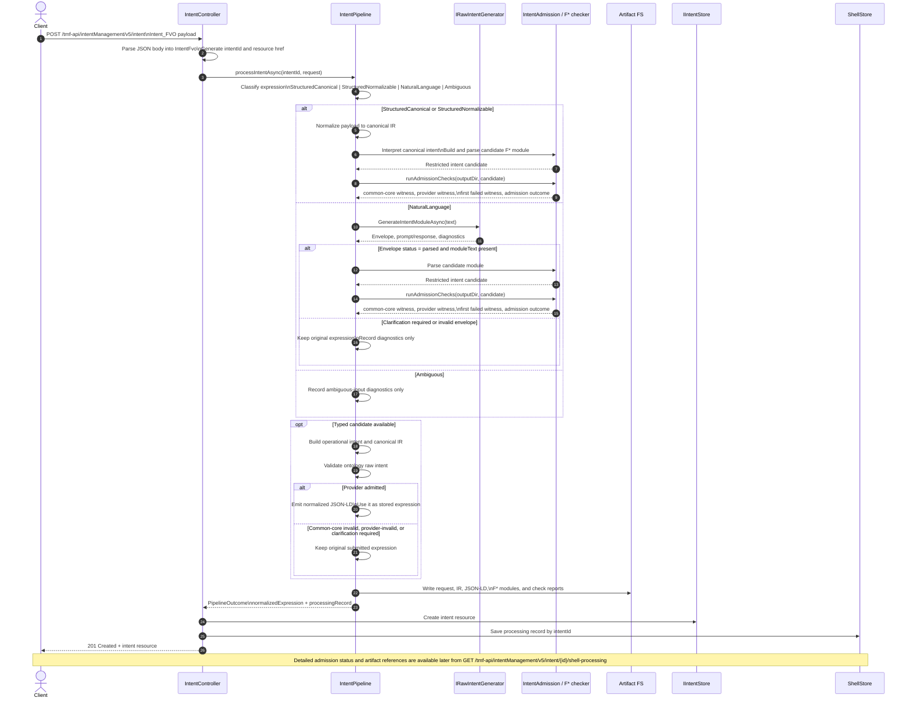

# Intent Submission Sequence

Notes:

- The sequence reflects the current `IntentController.Create` and `IntentPipeline.processIntentAsync` flow in this repo.
- The create call still persists an intent resource even when shell processing ends in rejection or clarification-required status.
- The resource expression is replaced with normalized JSON-LD only when provider admission succeeds.
